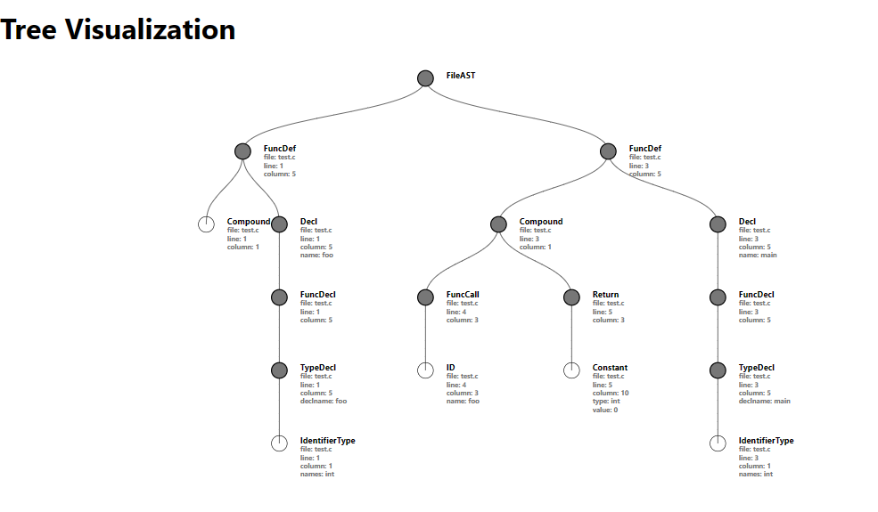

# Graph Visualization

The project is a web-based application that provides a user-friendly interface for visualizing and exploring Abstract Syntax Trees (ASTs) of code. It allows users to upload code snippets in various programming languages and generates tree-like visual representations of the code's structure. Users can interact with the AST, expand and collapse nodes, and explore code hierarchies easily. Additionally, the application parses and extracts relevant information from the code, such as variable declarations, function calls, and more, providing a comprehensive overview of the code's structure. This tool is useful for developers, educators, and anyone interested in understanding code structure and complexity in a visual and intuitive way.

## Table of Contents

- [About](#about)
  - [Purpose](#purpose)
  - [Background](#background)
- [Demo](#demo)
- [Getting Started](#getting-started)
  - [Available Scripts](#available-scripts)
    - [`npm start`](#npm-start)
    - [`npm test`](#npm-test)
    - [`npm run build`](#npm-run-build)
    - [`npm run eject`](#npm-run-eject)
- [Learn More](#learn-more)
  - [Code Splitting](#code-splitting)
  - [Analyzing the Bundle Size](#analyzing-the-bundle-size)
  - [Making a Progressive Web App](#making-a-progressive-web-app)
  - [Advanced Configuration](#advanced-configuration)
  - [Deployment](#deployment)
  - [`npm run build` fails to minify](#npm-run-build-fails-to-minify)

## About

**Graph Visualization** is an innovative web-based application designed to simplify the understanding and exploration of code structures. The primary purpose of this project is to provide a user-friendly interface for visualizing Abstract Syntax Trees (ASTs) derived from code snippets in various programming languages.

### Purpose

- **Code Understanding:** Our project aims to make code more accessible by offering a visual representation of code structures. This is particularly beneficial for developers, students, and educators who want to grasp complex code hierarchies more easily.

- **Educational Tool:** As an educational tool, the project serves as a valuable resource for teaching and learning about coding concepts. It empowers students to visually explore code structures and understand how code flows.

- **Development Aid:** For software developers, the project can be a valuable companion for understanding, debugging, and refactoring code. It provides insights into code hierarchies, function calls, and variable declarations.

### Background

The idea for this project originated from the desire to bridge the gap between code's abstract nature and its visual representation. We recognized that traditional textual code can be challenging to comprehend, especially when dealing with large and intricate codebases. By creating a tool that generates AST visualizations, we aim to make code more approachable and facilitate a deeper understanding of its structure.

Our team believes that visual representations of code offer a more intuitive way to navigate and analyze codebases. This project reflects our commitment to simplifying code comprehension and enhancing the learning experience for aspiring developers. It's our hope that **Graph Visualization** will contribute to improved code literacy and more effective software development practices.

## Demo

## Getting Started

This project was bootstrapped with [Create React App](https://github.com/facebook/create-react-app).

### Available Scripts

In the project directory, you can run:

#### `npm start`

Runs the app in the development mode.\
Open [http://localhost:3000](http://localhost:3000) to view it in your browser.

The page will reload when you make changes.\
You may also see any lint errors in the console.

#### `npm test`

Launches the test runner in the interactive watch mode.\
See the section about [running tests](https://facebook.github.io/create-react-app/docs/running-tests) for more information.

#### `npm run build`

Builds the app for production to the `build` folder.\
It correctly bundles React in production mode and optimizes the build for the best performance.

The build is minified and the filenames include the hashes.\
Your app is ready to be deployed!

See the section about [deployment](https://facebook.github.io/create-react-app/docs/deployment) for more information.

#### `npm run eject`

**Note: this is a one-way operation. Once you `eject`, you can't go back!**

If you aren't satisfied with the build tool and configuration choices, you can `eject` at any time. This command will remove the single build dependency from your project.

Instead, it will copy all the configuration files and the transitive dependencies (webpack, Babel, ESLint, etc) right into your project so you have full control over them. All of the commands except `eject` will still work, but they will point to the copied scripts so you can tweak them. At this point you're on your own.

You don't have to ever use `eject`. The curated feature set is suitable for small and middle deployments, and you shouldn't feel obligated to use this feature. However we understand that this tool wouldn't be useful if you couldn't customize it when you are ready for it.

## Learn More

You can learn more in the [Create React App documentation](https://facebook.github.io/create-react-app/docs/getting-started).

To learn React, check out the [React documentation](https://reactjs.org/).

### Code Splitting

This section has moved here: [https://facebook.github.io/create-react-app/docs/code-splitting](https://facebook.github.io/create-react-app/docs/code-splitting)

### Analyzing the Bundle Size

This section has moved here: [https://facebook.github.io/create-react-app/docs/analyzing-the-bundle-size](https://facebook.github.io/create-react-app/docs/analyzing-the-bundle-size)

### Making a Progressive Web App

This section has moved here: [https://facebook.github.io/create-react-app/docs/making-a-progressive-web-app](https://facebook.github.io/create-react-app/docs/making-a-progressive-web-app)

### Advanced Configuration

This section has moved here: [https://facebook.github.io/create-react-app/docs/advanced-configuration](https://facebook.github.io/create-react-app/docs/advanced-configuration)

### Deployment

This section has moved here: [https://facebook.github.io/create-react-app/docs/deployment](https://facebook.github.io/create-react-app/docs/deployment)

### `npm run build` fails to minify

This section has moved here: [https://facebook.github.io/create-react-app/docs/troubleshooting#npm-run-build-fails-to-minify](https://facebook.github.io/create-react-app/docs/troubleshooting#npm-run-build-fails-to-minify)

